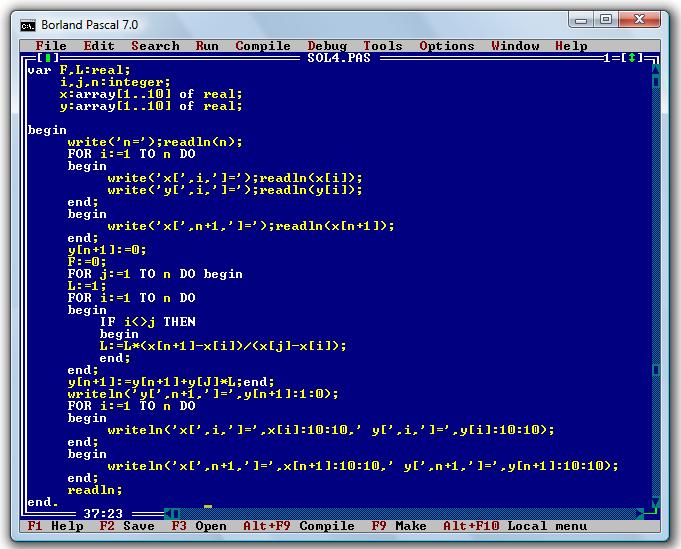

Mettre bannière avec charte sur toutes les bannières

# Plongez dans le monde du développement

Et c'est parti pour la première séance ! 🎉

Nous les verrons ensembles en classe, mais je vous récapitule ici ce que nous allons voir durant ce cours.

## Découvrez les objectifs du cours

### Découpage
- La première moitié du semestre (6 séances) sera consacrée aux bases de la programmation. Nous verrons des concepts qui sont communs à tous les langages. Nous travaillerons en JavaScript.
- La deuxième partie du semestre sera quant à elle consacrée au web plus spécifiquement. Vous apprendrez à créer une page web avec du HTML et CSS, à manipuler ses éléments toujours avec JavaScript, et à la peupler avec des datas (JavaScript également).

### Évaluation
L'évaluation sera faite tout au long du semestre. 
Chaque semaine, vous aurez des exercices à réaliser pour la séance suivante. 
À la fin du semestre, vous aurez un rendu à réaliser.
Votre note finale dépendra de votre participation, de votre régularité dans les exercices hebdomadaires, ainsi que de votre rendu final.

### Méthodologie

La méthodologie de ce cours sera différente de ce dont vous avez l'habitude à Sciences Po.

Elle sera inspirée du *learning by doing*. Nous ferons des exercices directement en cours, mais vous aurez également des exercices à faire par vous-mêmes. Parfois, vous n'aurez pas tous les éléments, vous aurez alors besoin d'interroger votre premier allié dans le développement : Google. 

La compétence principale des développeurs et développeuses est de savoir formuler de bonnes recherches sur **Google** (souvenez-vous de la pédagogie à 42, où il n'y a ni cours, ni professeur).

 `Je vous ai préparé une liste d'astuces pour faire une recherche Google efficace.` Je vous ai préparé une liste d'astuces pour faire une recherche Google efficace.
Une fois cette compétence acquise elle vous servira dans tous les domaines.

## Faites une première approche du code

Lançons-nous dans le coeur du sujet : le code.

### Le code est partout

Le code nous entoure dans tout ce que nous faisons : vos téléphones portables, vos consoles de jeux vidéos, tous les sites internet que vous consultez, même votre enceinte connectée... fonctionnent grâce au **code**. 

Mais au fait, c'est quoi le code ?

Le code consiste en des instructions : il permet de dire à un ordinateur (la partie hardware) quoi faire. 
On prend un exemple simple avec nos smartphones. Ils sont verrouillés par un mot de passe. 

Lorsque j'essaie d'ouvrir mon téléphone, il requiert un mot de passe. Je tape un mot de passe :
- Si le mot de passe est exact, le téléphone s'ouvre
- Si le mot de passe est incorrect, il me demande de le saisir à nouveau.
- Au bout de X tentatives, il bloque mon téléphone.
- etc.

Tout cela est réalisé grâce au code : les développeurs et développeuses ont défini le comportement de la machine avec le code.

### Bas niveau vs. haut niveau

Qu'est-ce qui nous permet de donner ces instructions ? Les langages informatiques. Il en existe plusieurs centaines (en comptant uniquement les langages utilisés, on en dénombre environ 240).

Certains langages sont plus adaptés pour des utilisations particulières. 

On peut distinguer :
- les langages haut niveau, où les instructions sont rédigées dans du texte facile à lire pour un humain, mais plus gourmand en ressources.
- les langages dits bas niveau, dont les instructions sont plus difficilement lisibles pour un humain, donc plus proche de la machine, donc plus optimisé. [Vous trouverez un exemple juste ici](https://miro.medium.com/max/1352/0*-Il8DFT-ga-U_sJF.png. 

Ensembles, nous apprendrons à manipuler le langage **haut niveau** JavaScript.

La développeuse ou le développeur va écrire son code dans un Editeur de texte : c'est un peu comme un Microsoft Word, sauf qu'il s'agit ici d'une version pour écrire du code. 
Il faudra ensuite exécuter ses commandes dans un terminal : un peu comme l'interface de votre ordinateur, sauf qu'il n'y a que du texte qui représente vos fichiers, et sur lequel vous lancez donc vos commandes.

## Mettez-vous au travail

Maintenant que vous avez quelques connaissances théoriques, profitons-en pour nous mettre au travail.

### Le matériel nécessaire

* Un ordinateur
Il est indispensable de ramener un ordinateur chaque semaine en cours. Pour coder, vous aurez besoin d'utiliser des caractères tels que `<>/*+-=()[]{}`.

> #ProTip: Sur MacOS, vous pouvez écrire des accolades {} en faisant shift+( ou shift+), et des crochets [] avec option+shift+( ou option+shift+).
Sur PC, vous devez utiliser la touche AltGr avec la touche correspondante.

* Un browser moderne
Nous allons faire du développement web. Pour cela, il est essentiel d'utiliser un navigateur qui est répandu. Pour ce cours, je vous recommande FireFox ou Google Chrome.

### Inscrivez vous sur Repl.it
Pour éviter d'avoir des logiciels spécifiques au développement à installer, nous allons utiliser un Environnement de Développement Intégré. Nous ferons tout sur [la plateforme Replit](https://replit.com/~).

Vous devriez avoir reçu une invitation par mail pour rejoindre la Team scpo-fall-2021. Je vous invite à créer un compte comme ici en indiquant la première lettre de votre prénom et nom de famille en nom utilisateur, et <u>avec votre adresse mail Sciences Po.</u> 👇

[Créer un compte sur Replit](./images/signup-page.png). 

Vous remplissez les différents champs. Et 🎉 vous avez accès à votre compte ! Vous pouvez confirmer votre adresse mail dès maintenant. Vous arrivez sur la page d'accueil. Normalement, si vous allez dans l'onglet Teams, vous devriez trouver la Team Sciences Po du cours :

[Ouvrir l'onglet Teams du cours](./images/teams.gif). 